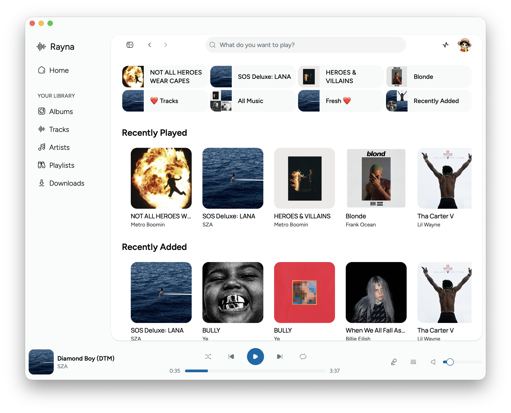
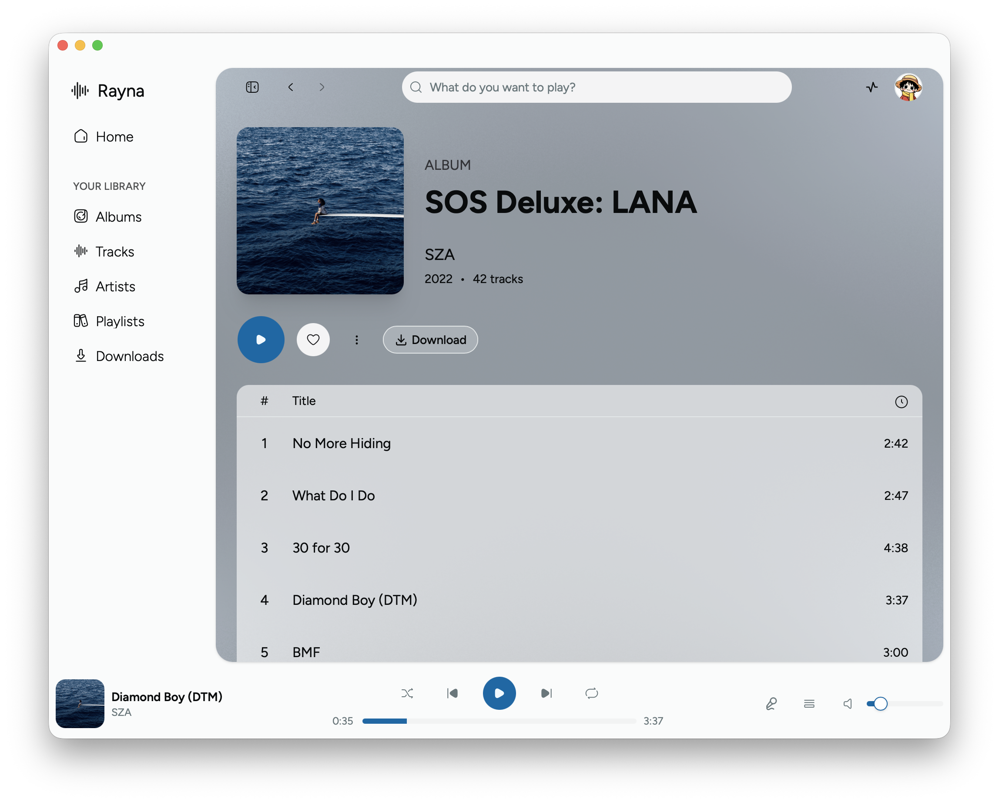
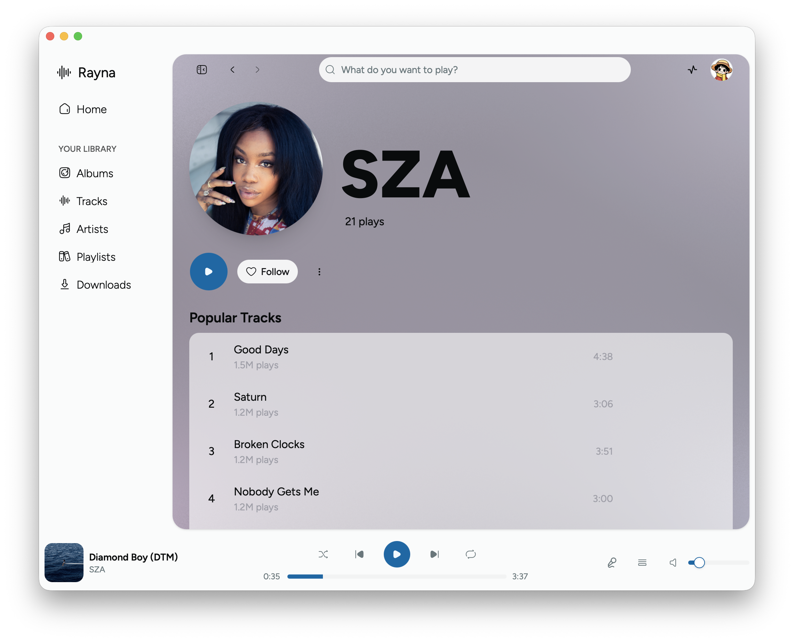

<!-- Improved compatibility of back to top link: See: https://github.com/othneildrew/Best-README-Template/pull/73 -->
<a id="readme-top"></a>
<!--
*** Thanks for checking out the Best-README-Template. If you have a suggestion
*** that would make this better, please fork the repo and create a pull request
*** or simply open an issue with the tag "enhancement".
*** Don't forget to give the project a star!
*** Thanks again! Now go create something AMAZING! :D
-->


<!-- PROJECT SHIELDS -->
<!--
*** I'm using markdown "reference style" links for readability.
*** Reference links are enclosed in brackets [ ] instead of parentheses ( ).
*** See the bottom of this document for the declaration of the reference variables
*** for contributors-url, forks-url, etc. This is an optional, concise syntax you may use.
*** https://www.markdownguide.org/basic-syntax/#reference-style-links
-->
<!-- [![Contributors][contributors-shield]][contributors-url]
[![Forks][forks-shield]][forks-url]
[![Stargazers][stars-shield]][stars-url]
[![Issues][issues-shield]][issues-url]
[![project_license][license-shield]][license-url]
[![LinkedIn][linkedin-shield]][linkedin-url] -->


<!-- PROJECT LOGO -->
<br />
<div align="center">
  <a href="https://github.com/ibb2/Rayna">
    
  </a>

<h3 align="center">Rayna</h3>

  <p align="center">
    <b>A Plex music player, inspired by Spotify.</b>
    <br />
    <!-- <a href="https://github.com/github_username/repo_name"><strong>Explore the docs »</strong></a>
    <br />
    <br />
    <a href="https://github.com/github_username/repo_name">View Demo</a>
    &middot;
    <a href="https://github.com/github_username/repo_name/issues/new?labels=bug&template=bug-report---.md">Report Bug</a>
    &middot;
    <a href="https://github.com/github_username/repo_name/issues/new?labels=enhancement&template=feature-request---.md">Request Feature</a> -->
  </p>
  <span>MacOS, Windows</span>
</div>


<!-- TABLE OF CONTENTS -->
<!-- <details>
  <summary>Table of Contents</summary>
  <ol>
    <li>
      <a href="#about-the-project">About The Project</a>
      <ul>
        <li><a href="#built-with">Built With</a></li>
      </ul>
    </li>
    <li>
      <a href="#getting-started">Getting Started</a>
      <ul>
        <li><a href="#prerequisites">Prerequisites</a></li>
        <li><a href="#installation">Installation</a></li>
      </ul>
    </li>
    <li><a href="#usage">Usage</a></li>
    <li><a href="#roadmap">Roadmap</a></li>
    <li><a href="#contributing">Contributing</a></li>
    <li><a href="#license">License</a></li>
    <li><a href="#contact">Contact</a></li>
    <li><a href="#acknowledgments">Acknowledgments</a></li>
  </ol>
</details> -->

<!-- ABOUT THE PROJECT -->
## About



<!-- Here's a blank template to get started. To avoid retyping too much info, do a search and replace with your text editor for the following: `github_username`, `repo_name`, `twitter_handle`, `linkedin_username`, `email_client`, `email`, `project_title`, `project_description`, `project_license` -->

Rayna is a 3<sup>rd</sup>-party music player for Plex, inspired by Spotify. Built with Electrobun it provides a UI built for the desktop.


<!-- ### Built With

* [![Next][Next.js]][Next-url]
* [![React][React.js]][React-url]
* [![Vue][Vue.js]][Vue-url]
* [![Angular][Angular.io]][Angular-url]
* [![Svelte][Svelte.dev]][Svelte-url]
* [![Laravel][Laravel.com]][Laravel-url]
* [![Bootstrap][Bootstrap.com]][Bootstrap-url]
* [![JQuery][JQuery.com]][JQuery-url]

<p align="right">(<a href="#readme-top">back to top</a>)</p> -->

## Features

#### Library

- Browse albums, tracks, artists, and playlists across selected Plex music libraries.
- Search the library for tracks, albums and artists.
- Filter and sort every library view.

#### Playback

- Play tracks, albums, artists, and playlists with standard media control (previous, next, seek, etc.).
- Add individual tracks to the queue or entire albums or playlists.
- Display Plex lyrics in a full listening view, including synchronized line highlighting[^2].
- Optionally transcode audio to 320 kbps Opus.
- Report and view playback sessions in Plex and Tautulli.
- Recover playback through network loss and change while retaining the current track, position, and queue.

#### Downloads and offline use

- Download tracks, albums, and playlists.
- Pause, resume, retry, remove, and monitor downloads from a activity menu.
- Browse downloads.
- Change the download location; existing files are moved safely.
- Synchronize selected libraries at startup, after network recovery, or with **Sync Now**.

#### Server and appearance

- Select Plex music libraries and servers[^3].
- Switch between light, dark, and system theme.
- Configure playback, offline storage, selected libraries, and synchronization from Settings.

<p align="right">(<a href="#readme-top">back to top</a>)</p>

<!-- GETTING STARTED -->
## Getting Started

Rayna currently targets macOS and Windows.

This is an example of how you may give instructions on setting up your project locally.
To get a local copy up and running follow these simple example steps.

### Prerequisites

This is an example of how to list things you need to use the software and how to install them.
* npm
  ```sh
  npm install npm@latest -g
  ```

### Downloads
> [!IMPORTANT]
> Windows on Arm is not natively supported.

> [!WARNING]
> Current macOS builds are not signed with a paid Apple Developer certificate and will need to be allowed manually.

| Platform | Download |
| --- | --- |
| Windows | [Installer (x64)](https://github.com/ibb2/Rayna/releases/latest/download/rayna-windows-installer.zip) |
| macOS | [DMG (x64, arm64)](https://github.com/edde746/Rayna/releases/latest/download/rayna-macos.dmg)  |

##### Post Install (Macos)
After install, open Terminal and run:

```sh
xattr -d com.apple.quarantine /Applications/Rayna.app
```

<p align="right">(<a href="#readme-top">back to top</a>)</p>


<!-- USAGE EXAMPLES -->
## Usage

<!-- Use this space to show useful examples of how a project can be used. Additional screenshots, code examples and demos work well in this space. You may also link to more resources. -->




<p align="right">(<a href="#readme-top">back to top</a>)</p>


<!-- ROADMAP -->
 ## Roadmap
<!--
- [x] Light and dark themes
- [x] Volume controls
- [ ] Current repository-owned screenshots
- [x] Artist pages
  - [x] Play popular tracks
  - [x] Browse the artist library
  - [x] Filter and sort artists
- [x] Playlist pages
  - [x] Play and queue an entire playlist
  - [x] Play and queue individual tracks
  - [x] Browse, filter, and sort playlists
- [x] Albums pages
  - [x] Browse albums
  - [x] View album details
  - [x] Complete-library filtering and sorting
- [x] Tracks page
  - [x] Browse, play, queue, and download tracks
  - [x] Complete-library filtering and sorting
  - [x] Infinite scrolling
- [x] Global search
- [x] Queue management
  - [x] Queue albums and playlists
  - [x] Queue individual tracks
  - [x] Display and clear the queue
- [x] User-managed offline support
  - [x] Track, album, and playlist downloads
  - [x] Pause, resume, retry, and remove
  - [x] Dedicated grouped Downloads page
  - [x] Download activity menu and album-detail downloaded state
  - [x] Configurable storage location
  - [x] Verify downloaded album and playlist playback while Plex is unreachable
- [x] Remote playback connection recovery
  - [x] Reconnect through the best available Plex route
  - [x] Preserve the current track, position, and queue after a network change
- [ ] Multiple music-library support
- [x] Server-scoped metadata, artwork, and lyrics caching
- [x] Versioned SQLite database
- [x] Plain and synchronized Plex lyrics
- [x] Performance improvements
- [x] Server selection
  - [x] Change between available Plex servers in the desktop UI
  - [x] Select multiple music libraries
- [x] Plex session reporting
- [x] Plex timeline reporting
- [x] Audio transcoding
- [x] Startup, recovery, and manual synchronization
- [x] Settings page
- [x] Previous and next controls -->

<!-- - [ ] Feature 1
- [ ] Feature 2
- [ ] Feature 3
    - [ ] Nested Feature -->

See the [open issues](https://github.com/ibb2/Rayna/issues) for a full list of proposed features (and known issues).

<p align="right">(<a href="#readme-top">back to top</a>)</p>

<!-- CONTRIBUTING -->

## Contributing
<!--
Contributions are what make the open source community such an amazing place to learn, inspire, and create. Any contributions you make are **greatly appreciated**.

If you have a suggestion that would make this better, please fork the repo and create a pull request. You can also simply open an issue with the tag "enhancement".
Don't forget to give the project a star! Thanks again!

1. Fork the Project
2. Create your Feature Branch (`git checkout -b feature/AmazingFeature`)
3. Commit your Changes (`git commit -m 'Add some AmazingFeature'`)
4. Push to the Branch (`git push origin feature/AmazingFeature`)
5. Open a Pull Request

<p align="right">(<a href="#readme-top">back to top</a>)</p>

### Top contributors:

<a href="https://github.com/github_username/repo_name/graphs/contributors">
  
</a> -->

Pull requests are welcome. For major changes, open an issue first to discuss the proposed behavior, and update or add tests for the affected feature.

<!-- See `contributing.md` for local development guidance and follow the repository's code of conduct. -->

<p align="right">(<a href="#readme-top">back to top</a>)</p>


<!-- LICENSE -->
## License

Distributed under the zlib license. See [`LICENSE.txt`](LICENSE.txt) for more information.

<p align="right">(<a href="#readme-top">back to top</a>)</p>


<!-- CONTACT -->
<!-- ## Contact

Your Name - [@twitter_handle](https://twitter.com/twitter_handle) - email@email_client.com

Project Link: [https://github.com/github_username/repo_name](https://github.com/github_username/repo_name)

<p align="right">(<a href="#readme-top">back to top</a>)</p>
 -->


<!-- ACKNOWLEDGMENTS -->
<!-- ## Acknowledgments

* []()
* []()
* []() -->

<!-- <p align="right">(<a href="#readme-top">back to top</a>)</p> -->


<!-- MARKDOWN LINKS & IMAGES -->
<!-- https://www.markdownguide.org/basic-syntax/#reference-style-links -->
[contributors-shield]: https://img.shields.io/github/contributors/github_username/repo_name.svg?style=for-the-badge
[contributors-url]: https://github.com/github_username/repo_name/graphs/contributors
[forks-shield]: https://img.shields.io/github/forks/github_username/repo_name.svg?style=for-the-badge
[forks-url]: https://github.com/github_username/repo_name/network/members
[stars-shield]: https://img.shields.io/github/stars/github_username/repo_name.svg?style=for-the-badge
[stars-url]: https://github.com/github_username/repo_name/stargazers
[issues-shield]: https://img.shields.io/github/issues/github_username/repo_name.svg?style=for-the-badge
[issues-url]: https://github.com/github_username/repo_name/issues
[license-shield]: https://img.shields.io/github/license/github_username/repo_name.svg?style=for-the-badge
[license-url]: https://github.com/github_username/repo_name/blob/master/LICENSE.txt
[linkedin-shield]: https://img.shields.io/badge/-LinkedIn-black.svg?style=for-the-badge&logo=linkedin&colorB=555
[linkedin-url]: https://linkedin.com/in/linkedin_username
[product-screenshot]: images/screenshot.png
<!-- Shields.io badges. You can a comprehensive list with many more badges at: https://github.com/inttter/md-badges -->
[Next.js]: https://img.shields.io/badge/next.js-000000?style=for-the-badge&logo=nextdotjs&logoColor=white
[Next-url]: https://nextjs.org/
[React.js]: https://img.shields.io/badge/React-20232A?style=for-the-badge&logo=react&logoColor=61DAFB
[React-url]: https://reactjs.org/
[Vue.js]: https://img.shields.io/badge/Vue.js-35495E?style=for-the-badge&logo=vuedotjs&logoColor=4FC08D
[Vue-url]: https://vuejs.org/
[Angular.io]: https://img.shields.io/badge/Angular-DD0031?style=for-the-badge&logo=angular&logoColor=white
[Angular-url]: https://angular.io/
[Svelte.dev]: https://img.shields.io/badge/Svelte-4A4A55?style=for-the-badge&logo=svelte&logoColor=FF3E00
[Svelte-url]: https://svelte.dev/
[Laravel.com]: https://img.shields.io/badge/Laravel-FF2D20?style=for-the-badge&logo=laravel&logoColor=white
[Laravel-url]: https://laravel.com
[Bootstrap.com]: https://img.shields.io/badge/Bootstrap-563D7C?style=for-the-badge&logo=bootstrap&logoColor=white
[Bootstrap-url]: https://getbootstrap.com
[JQuery.com]: https://img.shields.io/badge/jQuery-0769AD?style=for-the-badge&logo=jquery&logoColor=white
[JQuery-url]: https://jquery.com


## Footnotes

[^2]: When timed lyrics are available.
[^3]: No clue if this works.
