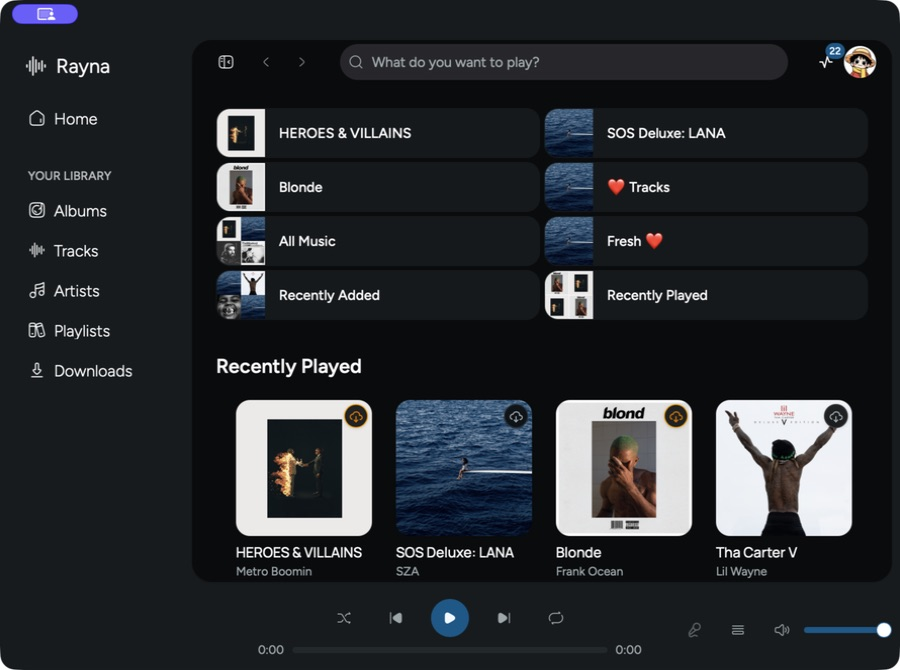
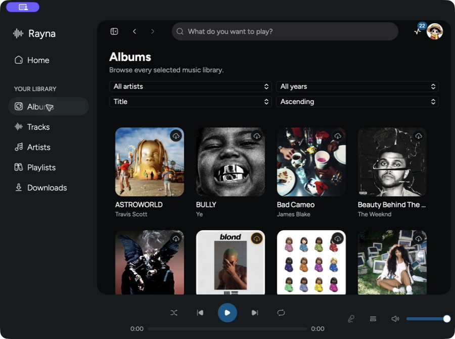
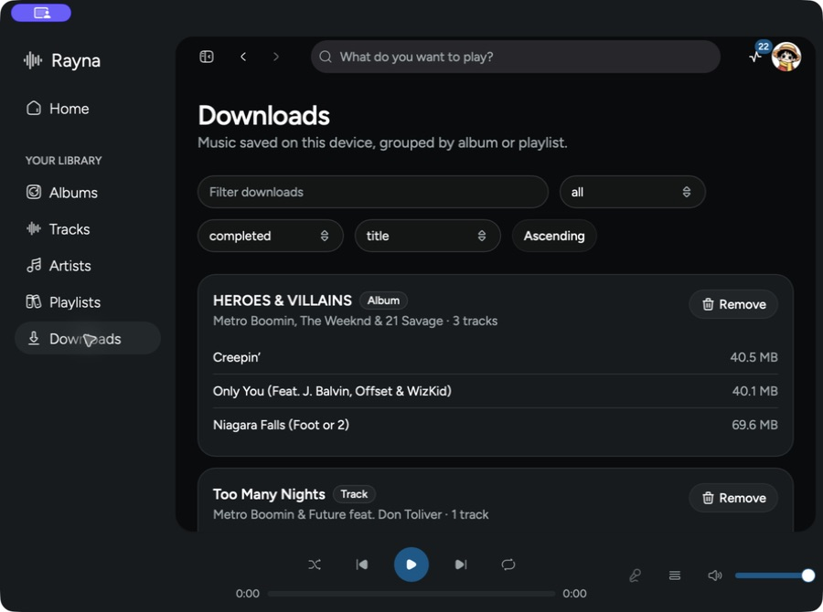

# Rayna

Rayna is a third-party desktop music player for Plex, inspired by Spotify. It combines a React interface with Electrobun and native BASS playback, with no separate backend service required.



## Features

### Library

- Browse albums, tracks, artists, and playlists across selected Plex music libraries.
- Search the complete library from the global search bar.
- Filter and sort every library view, including complete-library artist, album, and year facets.
- Automatically load additional tracks as the list is scrolled.

### Playback

- Play tracks, albums, artists, and playlists with previous, next, seek, volume, shuffle, and repeat controls.
- Add individual tracks, albums, or playlists to the queue and inspect the current queue.
- Display Plex lyrics in a full listening view, including synchronized line highlighting when timed lyrics are available.
- Optionally transcode audio to 320 kbps Opus and report playback sessions to Plex and Tautulli.
- Recover playback through the best available Plex connection while retaining the current track, position, and queue.

### Downloads and offline use

- Download tracks, albums, and playlists explicitly instead of mirroring the whole library.
- Pause, resume, retry, remove, and monitor downloads from a compact activity menu.
- Browse grouped downloads on a dedicated page with search, type, status, and sorting controls.
- Change the download location; existing files are moved safely.
- Prefer completed local files during playback and retain cached metadata, artwork, lyrics, and download state between restarts.
- Synchronize selected libraries at startup, after network recovery, or with **Sync Now**.

### Server and appearance

- Select Plex music libraries and preserve server-scoped caches and downloads.
- Switch between light, dark, and system themes, with an optional UltraBlur background.
- Configure playback, offline storage, selected libraries, and synchronization from Settings.

Rayna currently targets macOS, Windows, and Linux desktop builds. The roadmap and verification in this repository currently cover the macOS desktop runtime.

## Screenshots





## Installation

### Windows

> [!IMPORTANT]
> Windows on Arm is not natively supported.

1. Download the installer.
2. Run it and follow the on-screen instructions.

### macOS

> [!WARNING]
> Current macOS builds are not signed with a paid Apple Developer certificate and may need to be allowed manually.

1. Download and open the `.dmg`.
2. Drag Rayna into Applications.
3. If macOS blocks the application, open Terminal and run:

   ```sh
   xattr -d com.apple.quarantine /Applications/Rayna.app
   ```

## Usage

Log in to your Plex account, select a server, and choose one or more music libraries. Rayna then builds the Home and library views from those selections.

## Roadmap

- [x] Light and dark themes
- [x] Volume controls
- [x] Current repository-owned screenshots
- [x] Artist pages
  - [x] Play popular tracks
  - [x] Browse the artist library
  - [x] Filter and sort artists
- [x] Playlist pages
  - [x] Play and queue an entire playlist
  - [x] Play and queue individual tracks
  - [x] Browse, filter, and sort playlists
- [x] Albums pages
  - [x] Browse albums
  - [x] View album details
  - [x] Complete-library filtering and sorting
- [x] Tracks page
  - [x] Browse, play, queue, and download tracks
  - [x] Complete-library filtering and sorting
  - [x] Infinite scrolling
- [x] Global search
- [x] Queue management
  - [x] Queue albums and playlists
  - [x] Queue individual tracks
  - [x] Display and clear the queue
- [ ] User-managed offline support
  - [x] Track, album, and playlist downloads
  - [x] Pause, resume, retry, and remove
  - [x] Dedicated grouped Downloads page
  - [x] Download activity menu and downloaded-state indicators
  - [x] Configurable storage location
  - [ ] Verify downloaded album and playlist playback while Plex is unreachable
- [x] Remote playback connection recovery
  - [x] Reconnect through the best available Plex route
  - [x] Preserve the current track, position, and queue after a network change
- [x] Multiple music-library support
- [x] Server-scoped metadata, artwork, and lyrics caching
- [x] Versioned SQLite database
- [x] Plain and synchronized Plex lyrics
- [x] Performance improvements
- [x] Server selection
  - [ ] Verify changing between two available Plex servers in the desktop UI
  - [x] Select multiple music libraries
- [x] Plex session reporting
- [x] Plex timeline reporting
- [x] Audio transcoding
- [x] Startup, recovery, and manual synchronization
- [x] Settings page
- [x] Previous and next controls

## Non-goals

- TV/video playback and a ten-foot TV interface are outside Rayna's desktop music-player scope.

## Contributing

Pull requests are welcome. For major changes, open an issue first to discuss the proposed behavior, and update or add tests for the affected feature.

See `contributing.md` for local development guidance and follow the repository's code of conduct.

## License
